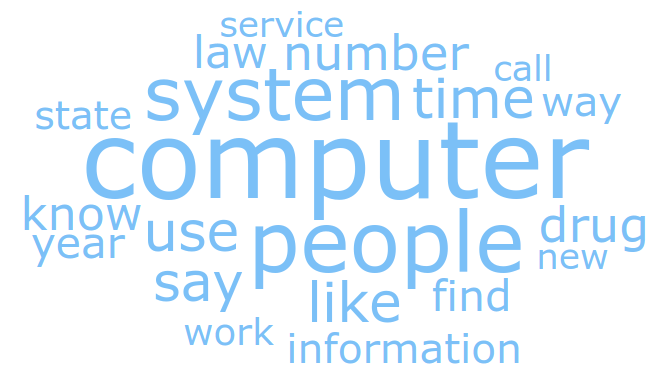

# Ergebnisse

Im Folgenden werden die Ergebnisse der Analyse dargelegt. Der Gesamtdatensatz entspricht den bereinigten und gefilterten Textdateien von textfiles.com. Die ersten zwei Analysen *Dokumente pro Jahr* und *Kategoriengrösse* dienen dazu, den Textkorpus zu beschreiben und die Beschaffenheit und Menge an Dateien pro Jahr, respektive pro Kategorie einzuschätzen. Mit den *Worthäufigkeiten* wird eine einfache Analyseart gewählt, um einen rudimentären Vergleich des Textkorpus mit der *Declaration* zu ermöglichen. Die *Entitäten* ähneln den *Worthäufigkeiten*, ermöglichen allerdings eine Analyse, die sich auf bestimmbare Einheiten (Personen, Organisationen, Länder etc.) konzentriert. Die *Scattertext* Visualisierung vereinfacht den grafischen Vergleich der *Worthäufigkeiten*. Schliesslich bietet die *Topic Diversity* Analyse eine Methode zur Generierung von Sprachmodellen und innerhalb davon die Clusterbildung von Themen. 

## Dokumente pro Jahr

Die Auswertung der Jahreszahlen der Dokumente spiegelt den Verlauf der Popularität der BBS, analog der in der Literatur beschrieben Entwicklung. Die beiden Messmethoden korrelieren stark ($r = 0.91$), wobei die Methode *lyear* gegenüber *eyear* einen deutlicheren Verlauf zeigt. In der manuellen Untersuchung der Top100 erreichte *lyear* eine höhere Korrelation mit den manuell bestimmten Jahreszahlen als *eyear*, was auch in dieser Auswertung zuzutreffen scheint. Diese Auffallend vielen Textdateien zwischen ca. 1988 und 1995 werden auch die anderen Ergebnisse beeinflussen. 

## Kategoriengrösse

Die Kategorisierung der einzelnen Textdateien wurde auf textfiles.com bereits vorgenommen. In diese Kategorien wird auch der ausgewertete Textkorpus gegliedert, wobei die Kategorie «sex»[^3] knapp 40% des Textkorpus ausmacht. Auch Politics (14%) und Occult (7%) kommen oft vor. Die restlichen 40% sind auf 36 Kategorien aufgeteilt. Die Betrachtung der Gesamtzeichenanzahl anstelle der Anzahl Dateien hat keinen Einfluss auf die Reihenfolge.

## Worthäufigkeiten

Die Worthäufigkeiten bestätigen, was in der Kategoriengrösse beobachtet wurde. Während im Datensatz der *Declaration* Wörter wie *world, government, people, computer, system, abuse, technology* (Auswahl aus $Freqency > 10$) vorkommen, sind es beim Gesamtdatensatz *cock, body, people, pussy, ass, girl, woman, tongue, suck, fuck* (Auswahl aus $Frequency > 7000$). Wörter, die der Kategorie «sex» zuzuordnen sind, überwiegen. Abgesehen vom Wort *People* stimmen keine weiteren sinntragenden Wörter in den häufigsten Wörter der beiden Auswertungen überein. Die Zusammenstellung der Worthäufigkeiten des Gesamtdatensatzes ohne die Kategorie «sex» enthält Wörter wie *people, system, world, life, computer, power, government, law, information, change, control, game* (Auswahl aus $Frequency > 3000$). In dieser Auswertung können Wörter gefunden werden, die mit der Auswertung der *Declaration* übereinstimmen: *computer, government, life, people, system, world etc.*

Die Anzahl Dateien, in denen ein jeweiliges Wort vorkommt, erscheint wenig hilfreich zu sein. Die häufigsten Wörter tragen keinen bestimmbaren Sinn, z.B. *time, start, year*, weniger häufige Wörter sind auch in dieser Auswertung durch die Kategorie «sex» verzerrt.

## Enitäten

In der Auflistung der Entitäten fällt auf, dass im Gesamtdatensatz Namen sehr hoch in der Rangliste stehen, gefolgt von Bezeichnungen für den amerikanischen Staat und deren Organisationen (FBI, CIA, NSA). Dies kann auch bei der *Declaration* beobachtet werden, allerdings ist ein Vergleich aufgrund der unterschiedlichen Textmengen kaum sinnvoll. Die Analyse ohne die Kateogire «sex» weisst deutlich weniger Namen auf. Spannender ist das Verhältnis von ausgewählten Begriffen zu der Häufigkeit, mit der FBI (399) oder CIA (486) vorkommt: *Apple (325), Constitution (270), IBM (166), EFF (80), Electronic Frontier Foundation (30), Fox (30), Neidorf (36), Radio Shack (37), Democratic (37), Cyberspace (29), Declaration of Independence (23)*

## Scattertext

\noindent
Die Scattertext Visualisierung zeichnet erneut ein recht deutliches Bild. Zwischen der *Declaration* und den BBS-Textfiles ist kein diagonaler Trend und somit keine oder kaum eine Korrelation erkennbar.[^1] Eine Auswertung ohne die Kategorie «sex» zeigt ein ähnliches Resultat. Wird die Scattertext Visualisierung für den Gesamtdatensatz, verglichen mit der Kategorie «100», generiert, kann eine Korrelation festgestellt werden. Dies deutet auf unzureichende Vergleichsdaten innerhalb der *Declaration* hin, während die Kategorie «100» die notwendige Grösse hat. 

## Topic Diversity

Mittels Topic Diversity Analysis wird einerseits der Gesamtdatensatz untersucht und zum Vergleich dazu der Datensatz der *Declaration*. Zur Auswertung wird nach einer Iteration gesucht, bei der die Topic Diversity hoch ist und gleichzeitig die Anzahl Topics ca. 10 beträgt. Insgesamt werden vier Experimente durchgeführt: je Datensatz (*Declaration* und Gesamtdatensatz) einmal mittels LDA [@srivastavaAutoencodingVariationalInference2017] und einmal mittels NeuralLDA [@bleiLatentDirichletAllocation2003].

Wie zu erwarten, können in den Experimenten des *Declaration* Datensatzes Topics gefunden werden, die sich um die Schwerpunkte der *Declaration* drehen. Die Topic Diversity ist bei LDA eher niedrig (0.3375), während bei NeuralLDA eine hohe (0.8857) festgestellt werden kann. Dies spiegelt sich auch in den Schlagwortwolken.[^2] Während LDA eine ziemlich wortgetreue Abbildung der *Declaration* erstellt, ist diese bei NeuralLDA zwar sinngemäss, aber nicht wortgetreu.

\noindent
Beim Gesamtdatensatz können mittels LDA ebenfalls Experimente mit eindeutigen Topics gefunden werden (eine davon in Abbildung X). Die Topic Diversity (0.3375) befindet sich in einem ähnlichen Bereich wie bei der *Declaration*. Mittels NeuralLDA können für den Gesamtdatensatz keine Experimente durchgeführt werden, die sinnvolle Topics generieren. 

[^1]: Zur Interpretation von Scattertext siehe: https://towardsdatascience.com/interpreting-scattertext-a-seductive-tool-for-plotting-text-2e94e5824858 (zugegriffen 30.08.2021)
[^2]: Die Abbildungen der Topics sind zu finden in *Anhang 5: Resultate*
[^3]: Die Kategorien werden in Anführungszeichen gekennzeichnet. Die Kategorie \textquote{sex} steht für sexuality und nicht Geschlecht, was in den Resultaten auch deutlich hervorgeht. 