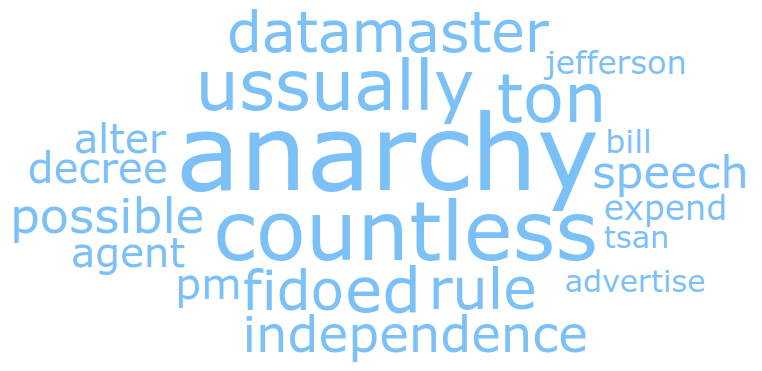
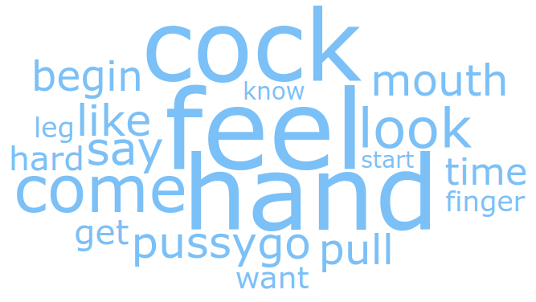

# Anhang

## Anhang 1: Manuelle Untersuchung der Top100

## Anhang 2: Sourcecode Top100

## Anhang 3: Textfiles.com Analysis

## Anhang 4: Sourcecode Textfiles.com

\newpage

## Anhang 5: OCTIS Topic Diversity

