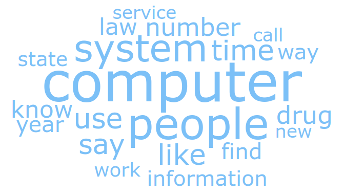

# Anhang

## Anhang 1: Manuelle Untersuchung Top100

\newpage\phantom{page}
\newpage\phantom{page}
\newpage\phantom{page}
\newpage\phantom{page}
\newpage\phantom{page}
\newpage\phantom{page}
\newpage\phantom{page}
\newpage\phantom{page}
\newpage\phantom{page}
\newpage\phantom{page}
\newpage\phantom{page}
\newpage\phantom{page}
\newpage\phantom{page}


## Anhang 2: Sourcecode Top100

\newpage\phantom{page}
\newpage\phantom{page}
\newpage\phantom{page}
\newpage\phantom{page}
\newpage\phantom{page}
\newpage\phantom{page}


## Anhang 3: textfiles.com Analyse

\newpage\phantom{page}
\newpage\phantom{page}
\newpage\phantom{page}
\newpage\phantom{page}
\newpage\phantom{page}
\newpage\phantom{page}
\newpage\phantom{page}
\newpage\phantom{page}
\newpage\phantom{page}


## Anhang 4: Sourcecode

\newpage\phantom{page}
\newpage\phantom{page}
\newpage\phantom{page}
\newpage\phantom{page}
\newpage\phantom{page}
\newpage\phantom{page}
\newpage\phantom{page}
\newpage\phantom{page}
\newpage\phantom{page}
\newpage\phantom{page}
\newpage\phantom{page}


## Anhang 5: Resultate

Dieser Anhang dient der Nachvollziehbarkeit. Die vollständigen Resultate inkl. Korpus sind zu finden unter:  

https://github.com/josiasbruderer/bbs-for-independence/tree/main/03_workspace/states (zugegriffen 30.08.2021) 

### Dokumente pro Jahr


### Kategoriengrösse

Anzahl Dokumente pro Kategorie nach Bereinigung und Filterung:  

* state_095_300_30000_categories/analysis/stats.csv


| category                | ndocs | nvocab    | nlength  | ndocp  | nvocabp | ndocp  |
|-------------------------|-------|-----------|----------|--------|---------|--------|
| art                     | 0     | 0         | 0        | 0.00%  | 0.00%   | 0.00%  |
| artifacts               | 0     | 0         | 0        | 0.00%  | 0.00%   | 0.00%  |
| digest                  | 0     | 0         | 0        | 0.00%  | 0.00%   | 0.00%  |
| exhibits                | 0     | 0         | 0        | 0.00%  | 0.00%   | 0.00%  |
| floppies                | 0     | 0         | 0        | 0.00%  | 0.00%   | 0.00%  |
| magazines               | 0     | 0         | 0        | 0.00%  | 0.00%   | 0.00%  |
| piracy                  | 0     | 0         | 0        | 0.00%  | 0.00%   | 0.00%  |
| tap                     | 0     | 0         | 0        | 0.00%  | 0.00%   | 0.00%  |
| fidonet-on-the-internet | 0     | 0         | 0        | 0.00%  | 0.00%   | 0.00%  |
| messages                | 1     | 186697    | 3832     | 0.02%  | 0.02%   | 0.01%  |
| declaration             | 1     | 186697    | 5089     | 0.02%  | 0.02%   | 0.01%  |
| 100                     | 2     | 373394    | 15490    | 0.04%  | 0.04%   | 0.02%  |
| media                   | 5     | 933485    | 70127    | 0.09%  | 0.09%   | 0.11%  |
| holiday                 | 7     | 1306879   | 35331    | 0.13%  | 0.13%   | 0.06%  |
| science                 | 8     | 1493576   | 36846    | 0.15%  | 0.15%   | 0.06%  |
| programming             | 14    | 2613758   | 196115   | 0.25%  | 0.25%   | 0.32%  |
| rpg                     | 15    | 2800455   | 128295   | 0.27%  | 0.27%   | 0.21%  |
| food                    | 15    | 2800455   | 139286   | 0.27%  | 0.27%   | 0.22%  |
| reports                 | 17    | 3173849   | 102885   | 0.31%  | 0.31%   | 0.17%  |
| hamradio                | 17    | 3173849   | 119696   | 0.31%  | 0.31%   | 0.19%  |
| virus                   | 17    | 3173849   | 180867   | 0.31%  | 0.31%   | 0.29%  |
| computers               | 22    | 4107334   | 222865   | 0.40%  | 0.40%   | 0.36%  |
| internet                | 29    | 5414213   | 311059   | 0.53%  | 0.53%   | 0.50%  |
| survival                | 29    | 5414213   | 322363   | 0.53%  | 0.53%   | 0.52%  |
| history                 | 30    | 5600910   | 326665   | 0.54%  | 0.54%   | 0.53%  |
| fun                     | 35    | 6534395   | 272652   | 0.64%  | 0.64%   | 0.44%  |
| music                   | 39    | 7281183   | 273950   | 0.71%  | 0.71%   | 0.44%  |
| news                    | 43    | 8027971   | 426174   | 0.78%  | 0.78%   | 0.69%  |
| hacking                 | 48    | 8961456   | 393191   | 0.87%  | 0.87%   | 0.63%  |
| games                   | 49    | 9148153   | 456712   | 0.89%  | 0.89%   | 0.74%  |
| phreak                  | 53    | 9894941   | 397485   | 0.96%  | 0.96%   | 0.64%  |
| groups                  | 59    | 11015123  | 769780   | 1.07%  | 1.07%   | 1.24%  |
| conspiracy              | 63    | 11761911  | 767596   | 1.14%  | 1.14%   | 1.24%  |
| ufo                     | 71    | 13255487  | 816498   | 1.29%  | 1.29%   | 1.31%  |
| law                     | 76    | 14188972  | 862562   | 1.38%  | 1.38%   | 1.39%  |
| bbs                     | 79    | 14749063  | 525500   | 1.43%  | 1.43%   | 0.85%  |
| adventure               | 79    | 14749063  | 716661   | 1.43%  | 1.43%   | 1.15%  |
| anarchy                 | 107   | 19976579  | 941863   | 1.94%  | 1.94%   | 1.52%  |
| sf                      | 123   | 22963731  | 1652889  | 2.23%  | 2.23%   | 2.66%  |
| stories                 | 138   | 25764186  | 1033873  | 2.50%  | 2.50%   | 1.66%  |
| humor                   | 152   | 28377944  | 724643   | 2.76%  | 2.76%   | 1.17%  |
| uploads                 | 158   | 29498126  | 875748   | 2.87%  | 2.87%   | 1.41%  |
| apple                   | 166   | 30991702  | 1723696  | 3.01%  | 3.01%   | 2.77%  |
| drugs                   | 187   | 34912339  | 1510700  | 3.39%  | 3.39%   | 2.43%  |
| etext                   | 240   | 44807280  | 2918710  | 4.36%  | 4.36%   | 4.70%  |
| occult                  | 373   | 69637981  | 3608148  | 6.77%  | 6.77%   | 5.81%  |
| politics                | 758   | 141516326 | 7874026  | 13.76% | 13.76%  | 12.67% |
| sex                     | 2185  | 407932945 | 30368320 | 39.66% | 39.66%  | 48.88% |

### Worthäufigkeiten

Worthäufigkeit pro Datenset nach Bereinigung und Filterung 

* state_080_300_30000_declaration/analysis/vocab_frq.txt
* state_095_300_30000_categories/analysis/vocab_frq.txt
* state_095_300_30000_categories/analysis/vocab_frq_no-sex.txt


| Declaration_Word | Declaration_n | All_Word | All_n | no-sex_Word | no-sex_n |
|------------------|---------------|----------|-------|-------------|----------|
| file             | 48            | time     | 25326 | Time        | 11434    |
| like             | 44            | like     | 24493 | People      | 10004    |
| board            | 44            | hand     | 24483 | like        | 8757     |
| think            | 33            | say      | 24107 | know        | 8281     |
| world            | 31            | feel     | 22968 | say         | 7354     |
| time             | 30            | look     | 22044 | work        | 7256     |
| know             | 30            | come     | 21704 | FIND        | 7088     |
| start            | 29            | know     | 20771 | use         | 7010     |
| go               | 27            | go       | 20255 | come        | 6840     |
| write            | 25            | cock     | 18508 | good        | 6647     |
| government       | 24            | get      | 17421 | Way         | 6538     |
| good             | 24            | want     | 16383 | man         | 6149     |
| new              | 24            | think    | 15538 | new         | 6092     |
| textfile         | 23            | begin    | 15214 | go          | 6057     |
| people           | 22            | take     | 14443 | thing       | 5683     |
| work             | 22            | tell     | 14323 | right       | 5673     |
| call             | 21            | way      | 14068 | look        | 5638     |
| number           | 21            | start    | 13978 | System      | 5506     |
| look             | 20            | good     | 13852 | think       | 5397     |
| come             | 20            | little   | 13829 | year        | 5146     |
| line             | 20            | head     | 13416 | need        | 5084     |
| great            | 20            | long     | 13110 | state       | 4930     |
| day              | 19            | work     | 12686 | long        | 4923     |
| want             | 18            | find     | 12431 | world       | 4916     |
| message          | 18            | hard     | 12265 | DAY         | 4894     |
| law              | 17            | pull     | 12182 | want        | 4890     |
| thing            | 17            | man      | 12152 | life        | 4861     |
| stuff            | 17            | mouth    | 12045 | take        | 4705     |
| use              | 16            | face     | 11880 | computer    | 4651     |
| get              | 16            | right    | 11856 | place       | 4457     |
| long             | 16            | body     | 11839 | get         | 4439     |
| person           | 15            | turn     | 11503 | leave       | 4355     |
| life             | 15            | leg      | 10987 | Power       | 4161     |
| computer         | 15            | let      | 10898 | tell        | 4142     |
| year             | 15            | people   | 10761 | call        | 4041     |
| public           | 14            | finger   | 10335 | END         | 3844     |
| state            | 14            | eye      | 10332 | try         | 3837     |
| begin            | 14            | thing    | 10165 | Great       | 3822     |
| find             | 14            | try      | 10140 | Number      | 3812     |
| right            | 13            | leave    | 10048 | little      | 3727     |
| Jason            | 13            | ask      | 10034 | government  | 3714     |
| leech            | 13            | see      | 10030 | see         | 3714     |
| try              | 12            | pussy    | 10007 | point       | 3705     |
| matter           | 12            | open     | 9304  | give        | 3697     |
| friend           | 12            | hold     | 9069  | Group       | 3635     |
| hard             | 12            | place    | 8729  | law         | 3527     |
| fact             | 12            | ass      | 8688  | information | 3467     |
| BBS              | 12            | stand    | 8553  | ASK         | 3437     |
| program          | 12            | room     | 8502  | hand        | 3433     |
| shall            | 11            | day      | 8493  | Turn        | 3425     |
| take             | 11            | girl     | 8311  | File        | 3410     |
| phone            | 11            | use      | 8309  | mean        | 3405     |
| send             | 11            | move     | 8295  | form        | 3347     |
| tell             | 11            | give     | 8210  | feel        | 3286     |
| system           | 11            | year     | 8173  | Old         | 3267     |
| word             | 11            | need     | 8065  | high        | 3256     |
| abuse            | 11            | woman    | 7905  | let         | 3193     |
| technology       | 11            | tongue   | 7878  | run         | 3187     |
| pq               | 11            | watch    | 7862  | start       | 3175     |
| fish             | 11            | lip      | 7768  | change      | 3167     |
| free             | 10            | away     | 7650  | Order       | 3162     |
| key              | 10            | sit      | 7560  | OPEN        | 3150     |
| power            | 10            | run      | 7510  | Control     | 3102     |
| copy             | 10            | reach    | 7486  | set         | 3079     |
| way              | 10            | suck     | 7466  | game        | 3055     |
| need             | 10            | fuck     | 7461  | case        | 3047     |
| post             | 10            | close    | 7460  |             |          |
| information      | 10            |          |       |             |          |
| guy              | 10            |          |       |             |          |
| disk             | 10            |          |       |             |          |
| raise            | 10            |          |       |             |          |


### Entitäten

Worthäufigkeit pro Datenset nach Bereinigung und Filterung 

* state_080_300_30000_declaration/analysis/entities_frq.csv
* state_095_300_30000_categories/analysis/entities_frq.csv
* state_095_300_30000_categories/analysis/entities_frq_no-sex.csv


| Declaration_Word  | Declaration_n | All_Word      | All_n | no-sex_Word   | no-sex_n |
|-------------------|---------------|---------------|-------|---------------|----------|
| one               | 11            | first         | 10343 | one           | 4813     |
| two               | 10            | two           | 8921  | first         | 4708     |
| first             | 9             | one           | 8624  | two           | 4051     |
| Megaterm          | 6             | three         | 3325  | three         | 1656     |
| AE                | 6             | second        | 2648  | One           | 1313     |
| today             | 6             | One           | 2156  | second        | 1178     |
| SysOp             | 5             | Linda         | 1679  | 1             | 1169     |
| Cyberspace        | 5             | Kim           | 1573  | 2             | 1100     |
| United States     | 4             | Lisa          | 1508  | American      | 1011     |
| three             | 4             | four          | 1506  | 3             | 984      |
| 10                | 4             | Karen         | 1448  | today         | 934      |
| Soviet            | 4             | today         | 1373  | four          | 884      |
| 300 1200          | 4             | 2             | 1294  | America       | 644      |
| 1                 | 4             | 1             | 1261  | United States | 622      |
| One               | 3             | 3             | 1174  | State         | 569      |
| 51                | 3             | half          | 1160  | 4             | 568      |
| Octothorpe        | 3             | Jim           | 1149  | 5             | 557      |
| Jason             | 3             | American      | 1104  | U.S.          | 548      |
| Chuck Hammill     | 3             | day           | 1041  | 10            | 547      |
| Thomas Covenant   | 3             | Mike          | 1027  | First         | 525      |
| Soviets           | 3             | Chris         | 995   | third         | 495      |
| Constitution      | 3             | third         | 942   | CIA           | 485      |
| 2.0               | 3             | Cindy         | 919   | day           | 475      |
| Sought After      | 2             | Dave          | 902   | Earth         | 437      |
| 50                | 2             | First         | 885   | US            | 437      |
| 200               | 2             | Mary          | 880   | Americans     | 433      |
| Congress          | 2             | Susan         | 874   | British       | 430      |
| IBM               | 2             | night         | 842   | half          | 426      |
| dozen             | 2             | Bill          | 838   | 6             | 415      |
| Washington        | 2             | John          | 808   | English       | 408      |
| RSA               | 2             | tonight       | 792   | years         | 400      |
| about 50          | 2             | few minutes   | 785   | FBI           | 398      |
| Ansi              | 2             | 5             | 730   | 12            | 357      |
| about 5           | 2             | Kevin         | 723   | Europe        | 348      |
| America           | 2             | Jack          | 716   | five          | 348      |
| 8                 | 2             | Jeff          | 705   | Mulder        | 347      |
| 914               | 2             | 4             | 699   | Picard        | 346      |
| Digital Dimension | 2             | 10            | 681   | Congress      | 345      |
| American          | 2             | Carol         | 667   | Christian     | 337      |
| WAITFOR           | 2             | America       | 661   | year          | 335      |
| zero              | 2             | Mark          | 644   | German        | 323      |
| second            | 2             | years         | 639   | Apple         | 322      |
| OPEC              | 2             | United States | 635   | 20            | 312      |
| Moscow            | 2             | five          | 630   | Two           | 309      |
| ftp               | 2             | Tom           | 628   | 8             | 301      |
| Nixon             | 2             | Steve         | 616   | night         | 297      |
| hundred           | 2             | Bob           | 602   | England       | 294      |
| PGP               | 2             | Sally         | 593   | seven         | 293      |
| Jason Scott       | 2             | Sharon        | 590   | six           | 286      |


### Scattertext


### Topic Diversity

Diese Grafiken sind eine manuelle Auswahl. Es ist jeweils vermerkt, zu welcher Iteration, Run und Topic die Grafik gehört.





\newpage


## Anhang 6: Messmethode lyear

Zur Identifikation des Ursprungsjahres dient folgender Python Code:

```python
def daterange(lst, t="r"):
    ltmp = []
    ltmp2 = []
    if len(lst) > 0:
        for l in lst:
            ltmp += list(filter(None, l))
        for l in ltmp:
            if len(l) == 2:
                ltmp2 += ["19" + l]
            else:
                ltmp2 += [l]
        if len(ltmp2) > 2:
            if t == "e":
                return str(min(ltmp2))
            elif t == "l":
                return str(max(ltmp2))
            else:
                return str(min(ltmp2) + "-" + max(ltmp2))
        else:
            return str(ltmp2[0])
    else:
        return "NA"

rxdate = re.compile('copyright.{0,3}(19[6-9][0-9])|'
                    'updated.{0,3}[0-1]?[0-9]?-[0-3]?[0-9]?'
                    '-([6-9][0-9])|Date\:.*([6-9][0-9]).*,|'
                    '(?:jan(?:uary)?|feb(?:ruary)?|mar(?:ch)?|'
                    'apr(?:il)?|may|june|july|aug(?:ust)?|'
                    'sept(?:ember)?|oct(?:ober)?|nov(?:ember)?'
                    '|dec(?:ember)?).{0,8}(1?9?[6-9][0-9])|'
                    '[0-1]?[0-9]?\/[0-3]?[0-9]?\/([6-9][0-9])|'
                    '[0-1]?[0-9]?-[0-3]?[0-9]?-([6-9][0-9])|'
                    '[^-](19[6-9][0-9])')

content = "Test content. New York, 01-01-1992"

matches = rxdate.findall(content, re.IGNORECASE)

metadata = {
'year': daterange(matches),
'eyear': daterange(matches, "e"),
'lyear': daterange(matches, "l")
}
```


Diese Auswertung überprüft, wie akkurat die gewählte Identifikation des Ursprungsjahres eines Textfiles ist. Die manuelle Identifikation des Jahres (myear) stellt den Referenzwert dar. Das älteste respektive frühst genanntes Jahr (eyear = earliest year) ist ungenauer ($r = 0.77$) als das jüngste respektive neuste genannte Jahr (lyear = latest year) ($r = 0.91$).

Bei der Untersuchung des Gesamtdatensatz (bereinigt und gefiltert von textfiles.com) konnte damit die Popularität von BBS gemessen werden. Die Korrelation zwischen lyear und eyear entspricht $r = 0.91$.


